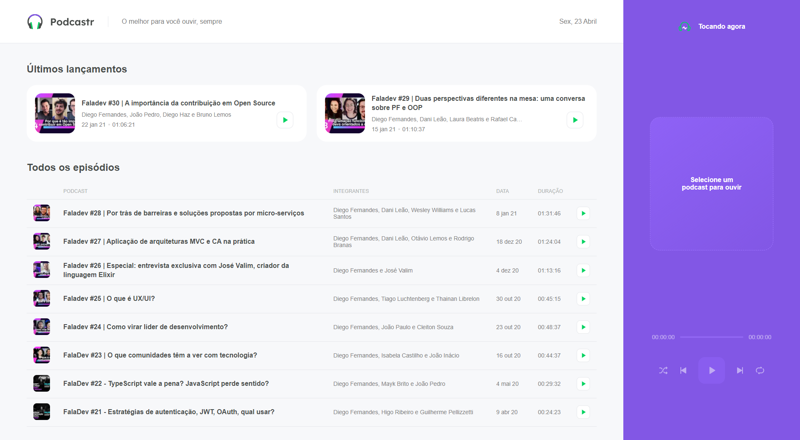

<h1 align="center">Podcastr</h1>

A aplicação tem o objetivo de reproduzir seus podcasts favoritos

<h3>✅ Status do projeto</h3>
<h4>Projeto em construção... 🧱</h4>

### ✅ Features
- [x] - Criação da pagína Home
- [x] - Criação da pagína de episódios
- [x] - Reprodução do podcast
- [x] - Reproduzir podcast aleátorios
- [x] - Repetir a reprodução do mesmo podcast
- [ ] - Responsividade da aplicação

<h3>✅ Demostração da aplicação</h3>
<h1 align="center">
  
</h1>

<h3>✅ Pré-requisitos e como rodar a aplicação</h3>

Antes de começar você precisar ter instalado em sua maquina o NodeJS (https://nodejs.org/en/) e o Git (https://git-scm.com/).
Para facilitar o desenvolvimento é interessante possuir um editor de código como o VSCode (https://code.visualstudio.com/).

### Rodando a aplicação
#### Abre o seu terminal e rode o comando abaixo
$ git clone https://github.com/lagalvao/Podcastr.git

#### Em seguida entre na pasta podcastr
$ cd podcastr

#### Depois rode o comando abaixo para instalar as dependências
$ npm install

#### Em seguiga execute o comando abaixo para rodar o backend fake da apliação
$ npm server

### Mantenha o backend fake rodando, execute os proximos passos para executar o frontend

#### Abra uma nova guia do termnial e rode o comando
$ npm dev

### 🛠 Tecnologias utilizadas Frontend
- [React] (https://pt-br.reactjs.org/)
- [Typescript] (https://www.typescriptlang.org/)
- [NextJS] (https://nextjs.org/)
- [Axios] (https://github.com/axios/axios)
- [Sass] (https://sass-lang.com/)
- [JSON-Server] (https://github.com/typicode/json-server)
